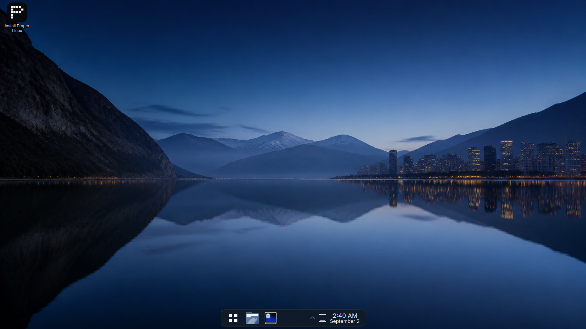

# Proper Linux

> Normal Linux. Properly finished.



Proper Linux is a lean, opinionated Fedora KDE desktop. It keeps Fedora's
normal mutable system and concentrates on the part people actually live in:
the desktop, its defaults, and the small interactions that make a computer
feel calm and deliberate.

The point is not to hide Linux or replace working infrastructure. The point is
to remove clutter, duplication, setup ceremony, and needless choices while
leaving the underlying system fully available.

## What makes it Proper

- A coherent dark desktop with curated wallpapers, clear typography,
  natural scrolling, selective translucency, and sensible settings from the
  first login.
- A quiet floating shelf with useful task states and familiar system controls,
  without redundant bars, launchers, hover noise, or decorative clutter.
- Vicinae as one polished place to browse apps, search, run actions, and reach
  common desktop tools with either pointer or keyboard.
- Normal floating windows, excellent snapping, a reversible arrangement tool,
  and concise shortcuts that accelerate rather than define the workflow.
- A simplified Dolphin experience, Ghostty 1.3.1 and `btop`, Chromium as the
  promoted browser, and a small set of genuinely useful defaults.
- Proper Apps: a broad optional catalogue that asks which product the user
  wants instead of making package formats the main decision.
- Easy access to coding agents as ordinary user applications.
- A build-enforced sub-3 GiB image with no bundled office suite, duplicate
  application stacks, games, or promotional welcome software simply because an
  upstream edition included them.

Proper Linux is still Fedora underneath: kernel, drivers, networking,
security, installer, updates, DNF, Flatpak, System Settings, and the normal
ability to change any default remain intact.

## Status

Proper Linux is in development. There is no public release yet.

## Build and run

The image build requires an x86-64 Linux environment with privileged KIWI or
Podman support. Graphical validation additionally requires QEMU/KVM.

```bash
scripts/build-iso
scripts/run-vm /absolute/path/to/Proper-Linux.iso
```

Build output is written outside the repository to `../proper-linux-build` by
default. A successful build emits the ISO and its SHA-256 checksum; a release
is not considered usable until the ISO also installs and boots in a fresh VM.

## Documentation

- [Product and experience](docs/PRODUCT.md) — what Proper Linux is, what it
  changes, and why those choices matter.
- [Architecture and delivery](docs/ARCHITECTURE.md) — how the product is built,
  packaged, updated, and verified.

## Product rule

Preserve Fedora unless a user can see the problem, feel the problem, or is
unnecessarily forced to understand the problem.

## Naming and licensing

“Proper Linux” remains a working name pending formal trademark review. The
project will remain publicly downloadable and open source. Component licences
and asset provenance are recorded beside the packages and files they govern.
