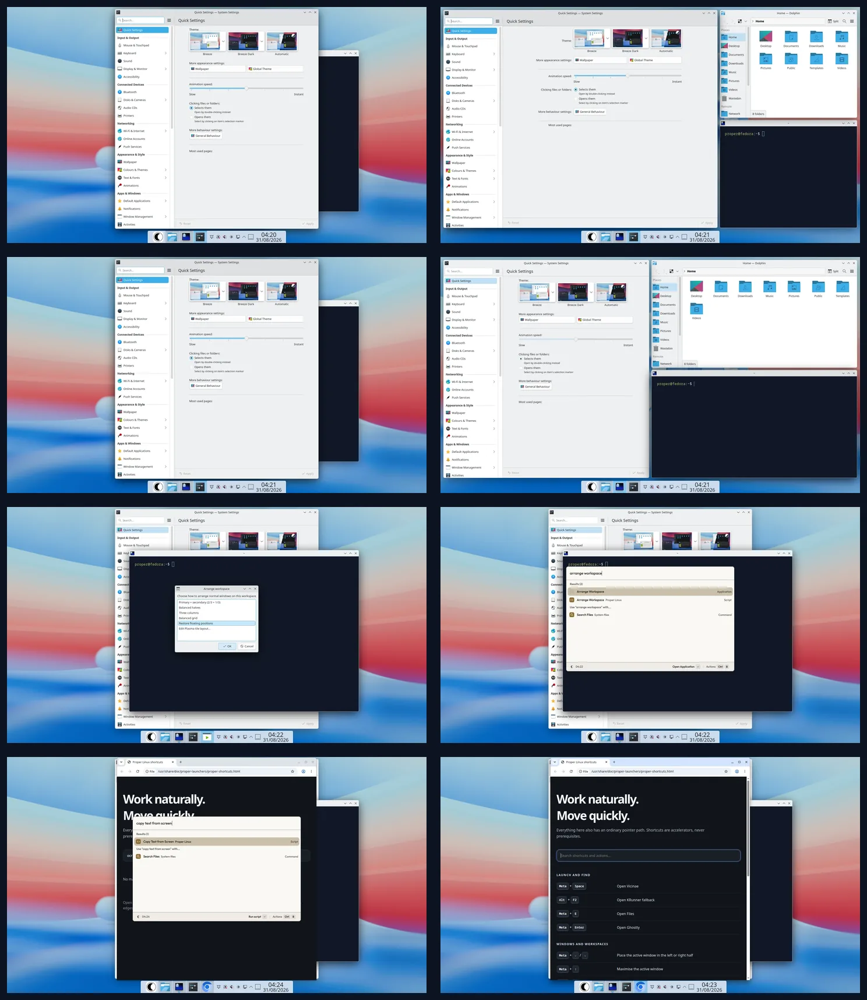

# Phase 11 workflow evidence

## Review status

The implementation and installed-VM checks are complete. The interaction and
visual direction remain ready for the PM workflow review defined in
`docs/ACCEPTANCE.md`.

## PM review sheet

Read left to right, top to bottom: floating baseline, primary layout, restored
geometry, a newly opened floating window, pointer chooser, Vicinae arrangement,
Vicinae OCR, and the searchable shortcut guide. The runtime checks and evidence
limits are recorded below.

## Environment

- Installed Fedora 44 Proper reference VM, not a container or HTML mock-up
- 1920x1080 framebuffer at 200% desktop scaling
- `proper-defaults-0.1-14.fc44.noarch`
  (`25f455b2c950b77a925e7828022a82111a64c06b7a86a0268cecb4e3821d2431`)
- `proper-launchers-0.1-8.fc44.x86_64`
  (`bb9aedf49fb13d2910b9f24bcd1d8432923df8df600fa980200f3ed55985cc65`)
- Fedora `tesseract-5.5.3-1.fc44`, English language data, and `wl-clipboard`

## Captures

1. [Three ordinary floating windows before arrangement](01-floating-before.webp)
2. [Primary two-thirds layout applied](02-primary-layout.webp)
3. [Captured floating geometry restored](03-restored.webp)
4. [A window opened after arrangement remains floating](04-new-window-floats.webp)
5. [Pointer-accessible layout chooser](05-pointer-layout-chooser.webp)
6. [Arrange Workspace found through Vicinae](06-vicinae-arrange-search.webp)
7. [Local OCR action found through Vicinae](07-vicinae-ocr-search.webp)
8. [Pointer-accessible, searchable shortcut guide](08-shortcut-guide.webp)

## Runtime results

- The KWin script registered its six Proper actions with KGlobalAccel and
  produced no script error after login.
- Primary, halves, columns, and grid commands select only eligible ordinary
  windows on the active workspace and output. The default toggle applies the
  primary layout and then restores the captured geometry and maximised state.
- Opening another application after arranging does not reflow the layout; the
  new window remains freely floating.
- The layout chooser works by pointer and invokes KWin through the ordinary
  user-session shortcut service. `Meta+Shift+T` invokes the same toggle.
- Vicinae indexed all 15 packaged script commands. Searches for arrangement and
  OCR returned the expected Proper actions.
- The shortcut guide opened by pointer and its client-side filter narrowed the
  visible actions without a network dependency.
- Tesseract extracted recognisable text from a Spectacle capture of the guide.
  A `wl-copy`/`wl-paste` round trip returned the expected value. The production
  OCR helper creates private temporary files and removes them on exit.

## Evidence limits

The VM has one display and no Bluetooth adapter, battery, or real audio device.
The promoted utility actions correctly reached their upstream settings or
empty states, but hardware-present Bluetooth, battery, audio-routing, and
multi-display placement remain part of later hardware or final-candidate
coverage. PM review is still required for the interaction and visual judgment;
these checks establish function, packaging, and reversibility.
