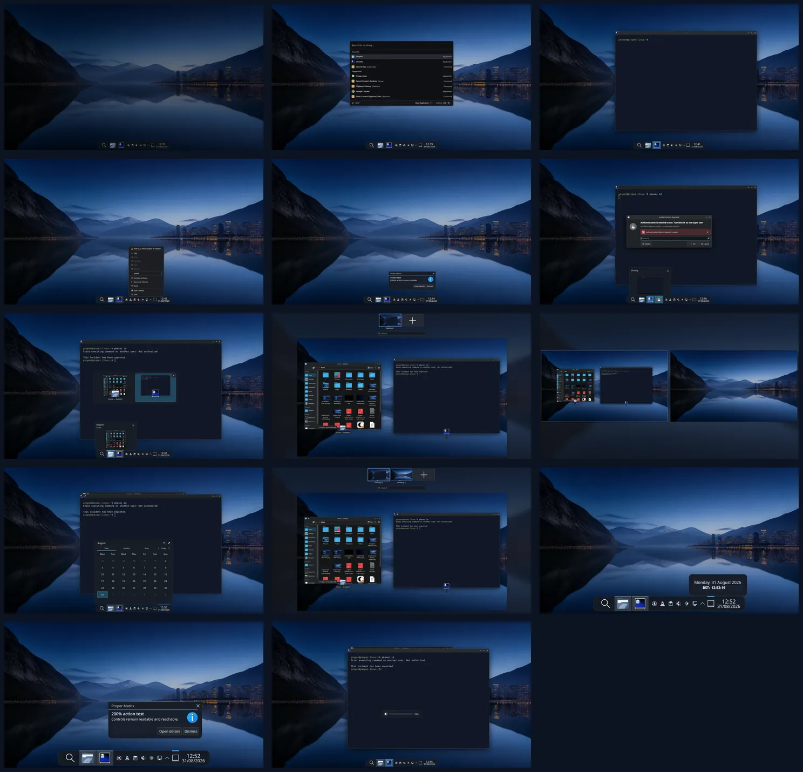

# Phase 9 packaged shell regression

## Review status

The package, 100%/200% scale, blur, reduced-motion, and interaction matrix is
complete in the installed Fedora 44 review VM. The PM-approved shell direction
is unchanged. Two-display and rotated-output coverage remains part of the
Phase 12 final-candidate run.

## Contact sheet

## Environment

- One installed Proper QEMU/KVM VM at a 1920x1080 framebuffer
- `proper-look-and-feel-0.1-14.fc44.noarch`
  (`5a9b355f825e511c0297246d461a44baa7ecf73fc1007a86cd6d800ae24c9119`)
- `proper-defaults-0.1-15.fc44.noarch`
  (`4c9484dfc0d49eb1642f331a9c4af0e998c4984a5f9896248c672489fbb8b45d`)
- `proper-launchers-0.1-9.fc44.x86_64`
  (`6b2e4175402e5b9510137e4411d18d0ef523c467335d77c12af8365c2155e559`)
- Blur enabled for the primary run, explicitly unloaded through KWin D-Bus
  for the fallback run, then restored
- Scale 1 and scale 2 applied through KScreen and restored to scale 1

## Curated captures

1. [100% panel with blur](01-panel-100-blur.webp)
2. [Launcher opened through the taskbar pointer path](02-pointer-launcher.webp)
3. [Ghostty launched from the pointer-selected result](03-pointer-launch-result.webp)
4. [VLC third-party tray icon and context menu](04-third-party-tray.webp)
5. [Notification with pointer actions](05-notification-actions.webp)
6. [Polkit wrong-password state](06-polkit-failure.webp)
7. [Alt+Tab with two ordinary windows](07-alt-tab.webp)
8. [KWin Overview](08-overview.webp)
9. [Desktop Grid with two workspaces](09-desktop-grid.webp)
10. [Readable calendar with blur unloaded](10-blur-disabled-calendar.webp)
11. [Overview with the animation factor set to zero](11-reduced-motion-overview.webp)
12. [Panel at 200% scale](12-scale-200-panel.webp)
13. [Action notification at 200% scale](13-scale-200-notification.webp)
14. [Volume OSD](14-volume-osd.webp)

## Matrix results

| Check | Installed-VM result |
| --- | --- |
| Package update | Release 14 upgraded release 13; the installed panel and dialog assets each contain one compose hint and nine neutral fallback-suppression slices |
| Rounded surfaces | Panel, tooltip, calendar, notification, Polkit, OSD, and tray menu expose no square shadow, blur, or contrast bounds |
| Pointer and keyboard | Taskbar launcher, result selection, task launch, tray menu, notification action, Polkit cancellation, workspace selection, `Meta+Space`, Alt+Tab, Overview, Desktop Grid, and keyboard workspace switching passed |
| Third-party tray | VLC's StatusNotifier icon rendered, expanded the fit-content panel correctly, and exposed its complete upstream context menu |
| Notification actions | Both buttons rendered at 100% and 200%; clicking **Dismiss** returned the `dismiss` action and closed the popup |
| Authentication | A wrong password produced the upstream error state; pointer cancellation closed the agent and returned an unauthorised result without hanging |
| Blur disabled | KWin reported the blur effect unloaded; the panel and calendar remained opaque, readable, and correctly rounded |
| Reduced motion | `AnimationDurationFactor=0` applied and Overview remained immediately usable; the original factor was restored afterward |
| Scaling | The panel, tooltip, launcher, notification text, and action buttons remained visible and reachable at 200% |
| Workspace effects | Alt+Tab, Overview, Desktop Grid, pointer workspace selection, and keyboard switching all changed to the expected state |
| OSD | Volume down/up produced the rounded upstream OSD and returned the volume to 100% |

Vicinae uses a single click to focus/select a result and an ordinary double
click to activate it; the keyboard activation path remains `Enter`. This is
the current upstream pointer behaviour, not a missing pointer path.

## User-choice preservation

The package update and the complete matrix left the protected user files
byte-for-byte unchanged. The same hashes were recorded before the release-14
upgrade and after every temporary matrix setting was restored:

- `plasma-org.kde.plasma.desktop-appletsrc` —
  `0f38633d3c063ee754bdb064e5bd80333a0a0119a06c961f9a467b31f190ec30`
- `kdeglobals` —
  `bbc11bc2a3e53660104a059717eec74481f20611e515e16f264ce1505a3e6c7f`
- `plasmashellrc` —
  `544dddf134446febf075994ed67b232d9bf90424a775556af51b8954fb45239e`
- `kwinrc` —
  `ca541d0c9057a666a7594591c8963b040aa705f6a75c9a2fcc00e4b928e67dd8`

The VM finished at 1920x1080, scale 1, one workspace, blur enabled, animation
factor 1, no user theme override, and no VLC test process.
