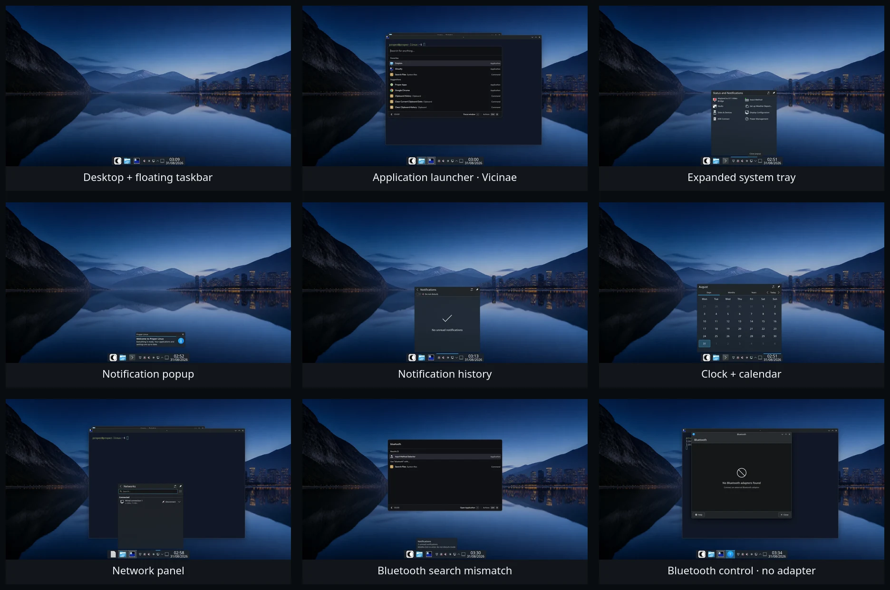
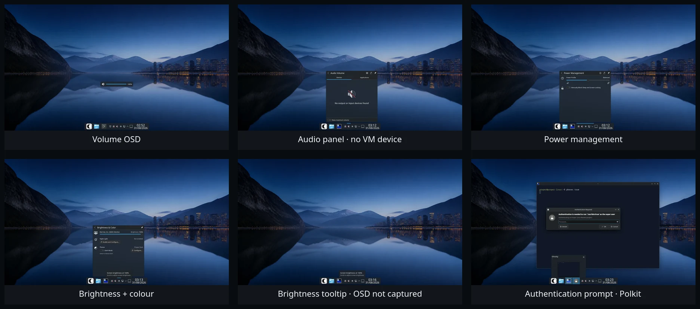
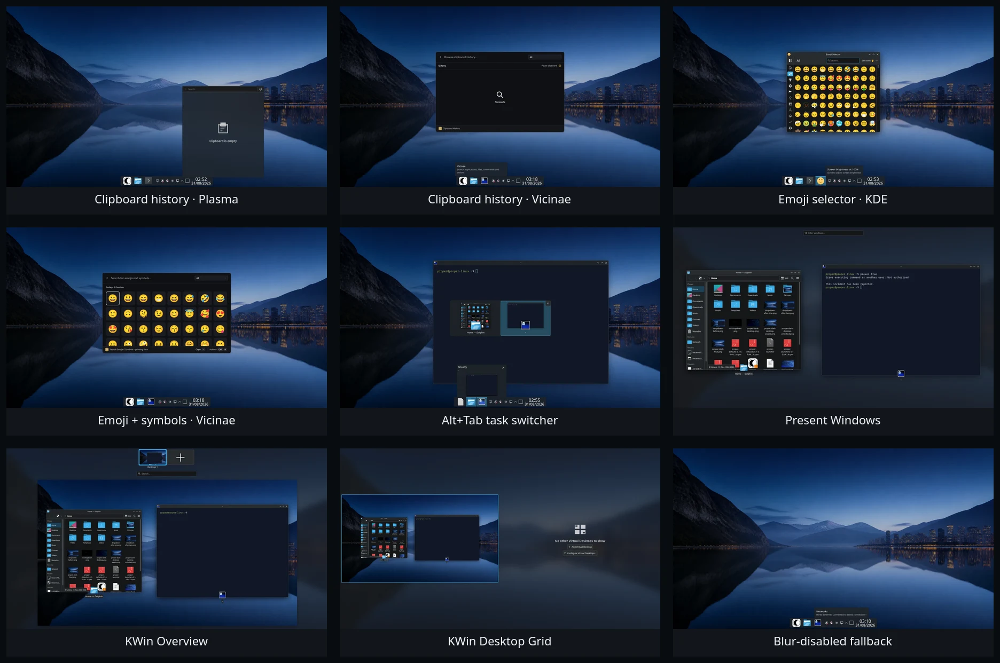
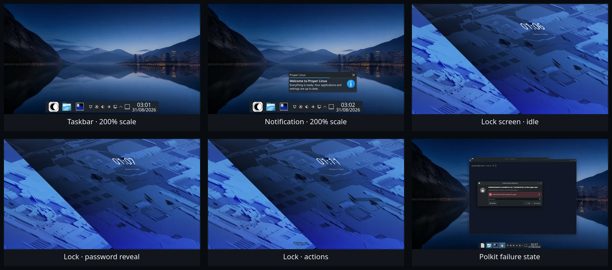

# Phase 9 shell-surface evidence

## Review status

The installed-VM baseline is ready for PM review. It is not an approval of the
current appearance. The component-retention recommendations below are
provisional until the PM marks each surface sufficient, theme-only, or in need
of deeper redesign.

## Contact sheets

## Environment

- Installed Fedora 44 Proper review VM, not a container or HTML mock-up
- 1920x1080 framebuffer at 100% and 200% scale
- Blur enabled for the primary set and explicitly unloaded for the fallback
  capture
- `proper-look-and-feel-0.1-10.fc44.noarch`
  (`ddee8fad9ca06dd19e3b72ddc21a889b3baad1f520575fbced77749191965631`)
- `proper-defaults-0.1-13.fc44.noarch`
  (`15314e4ee8cf96dc206e4352106f89b997e7656c906cee8a899370f424b9a582`)

## Individual captures

1. [Taskbar at rest](01-taskbar.webp)
2. [Vicinae from the taskbar](02-vicinae.webp)
3. [Clock and calendar](03-calendar.webp)
4. [Expanded system tray](04-tray.webp)
5. [Notification popup](05-notification.webp)
6. [Notification history](05b-notification-history.webp)
7. [Volume OSD](06-volume-osd.webp)
8. [Connected-network panel](07-network.webp)
9. [Audio empty state](07b-audio-empty.webp)
10. [Power management](07c-power-management.webp)
11. [Brightness and colour](07d-brightness-colour.webp)
12. [Brightness tooltip](07e-brightness-osd.webp)
13. [Plasma clipboard empty state](08-clipboard.webp)
14. [Vicinae clipboard history](08b-clipboard-vicinae.webp)
15. [KDE emoji selector](09-emoji.webp)
16. [Vicinae emoji and symbols](09b-emoji-vicinae.webp)
17. [Polkit failure state](10-polkit-failure.webp)
18. [Alt+Tab switcher](11-alt-tab.webp)
19. [KWin Overview](12-overview.webp)
20. [KWin Desktop Grid](13-desktop-grid.webp)
21. [Present Windows](13b-present-windows.webp)
22. [Taskbar at 200%](14-scale-200-panel.webp)
23. [Notification at 200%](15-scale-200-notification.webp)
24. [Readable blur-disabled fallback](16-blur-disabled.webp)
25. [Vicinae Bluetooth search mismatch](17-bluetooth-launcher-search.webp)
26. [BlueDevil no-adapter state](17b-bluetooth-no-adapter.webp)
27. [Live Polkit prompt](18-polkit-prompt.webp)
28. [Proper lock screen at rest](19-lock-idle.webp)
29. [Proper lock password reveal](19b-lock-password-reveal.webp)
30. [Proper lock action menu](19c-lock-actions.webp)

## Provisional assessment for the PM

| Surface | Current reading | Lowest-maintenance direction | PM decision |
| --- | --- | --- | --- |
| Floating panel and taskbar | Distinctive overall; the clock/date block and status cluster are crowded | Keep Plasma behaviour; refine spacing, clock composition, and task/status states | Pending |
| Vicinae launcher | The strongest and most Proper-coherent stock surface in the set | Keep and improve its system-action catalogue | Pending |
| System tray | Functional but dense and visually generic | Keep the upstream tray; theme its container, spacing, and state assets | Pending |
| Notifications | Clear enough, but hierarchy and empty-state composition are stock Breeze | Keep delivery/history; theme the popup and history surface | Pending |
| Clock and calendar | Usable, visually generic, and larger than its information density warrants | Keep the applet; tune through Plasma Style and supported settings | Pending |
| Network | Clear and security-maintained upstream workflow | Keep `plasma-nm`; style only | Pending |
| Bluetooth | BlueDevil's empty state is fine, but searching `Bluetooth` in Vicinae incorrectly returns Input Method Selector | Keep BlueDevil; fix launcher discovery and validate real hardware later | Pending |
| Audio and power | Empty and desktop states are legible; hardware-present states are not represented | Keep Plasma PA and PowerDevil; style only until hardware testing finds a failure | Pending |
| Brightness and colour | Controls are understandable, but `Proper Dark` and `Switch to Breeze Dark` conflict in the same panel | Fix the wording/state integration; keep PowerDevil | Pending |
| OSDs | Volume is clear but generic; a true brightness-key OSD was not captured | Treat OSD assets as a narrow Proper Plasma Style target | Pending |
| Clipboard and emoji | Vicinae variants fit Proper better; Plasma/KDE variants remain useful fallbacks | Promote Vicinae paths without replacing the upstream services | Pending |
| Polkit authentication | Functionally conventional but the roughest visual outlier | First use application palette, icons, and decoration; avoid a security-sensitive fork | Pending |
| Alt+Tab and KWin workspace views | Coherent and capable; Overview is dense at a 960x540 logical workspace | Keep upstream KWin effects; tune configuration only | Pending |
| Lock screen | Already a custom Proper composition with pointer actions and progressive password reveal | Keep the Phase 8 implementation | Pending |
| 200% scale | Fits on the deliberately small logical workspace, but the panel becomes visually heavy | Retain functional behaviour and refine density after PM direction | Pending |

## Interaction results and evidence limits

Pointer and keyboard paths were exercised for task launching, tray and clock,
notification close/history, connected networking, PowerDevil controls,
clipboard, emoji, Polkit cancellation/failure/success, Alt+Tab, Overview,
Desktop Grid, Present Windows, and the lock screen. Blur-disabled and 200%
fallbacks remain legible.

The VM exposes one wired network interface, no Bluetooth adapter, no battery,
no real audio device, and one display. Pairing/connected Bluetooth, live audio
routing, battery-present, and second-display states therefore still need real
or suitably emulated hardware. The file retained as `07e-brightness-osd.webp`
shows the brightness tooltip, not a true key-triggered OSD; QEMU could not send
the required brightness key in this run.

The baseline contact sheets answer the current visual-review question. A full
state matrix still remains if the PM wants evidence for panel hover/urgent/edit
states, notification actions/progress/do-not-disturb, muted and microphone
OSDs, authentication success/cancellation, hostile third-party tray icons,
reduced motion, and multi-display placement.
