# Proper Linux wallpapers

All 13 wallpapers below are included in Proper. Click a preview to open the
full-size image, then use GitHub’s download button to save it.
The image files live [in this folder](./), alongside this page.

| Wallpaper | Wallpaper |
| --- | --- |
| [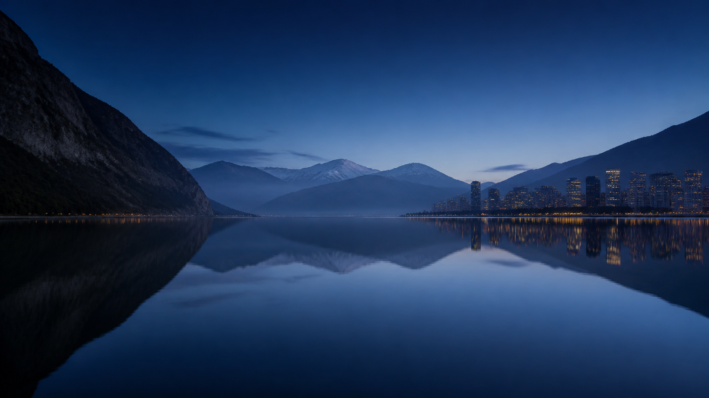](proper-blue-hour.png) Blue Hour (default) | [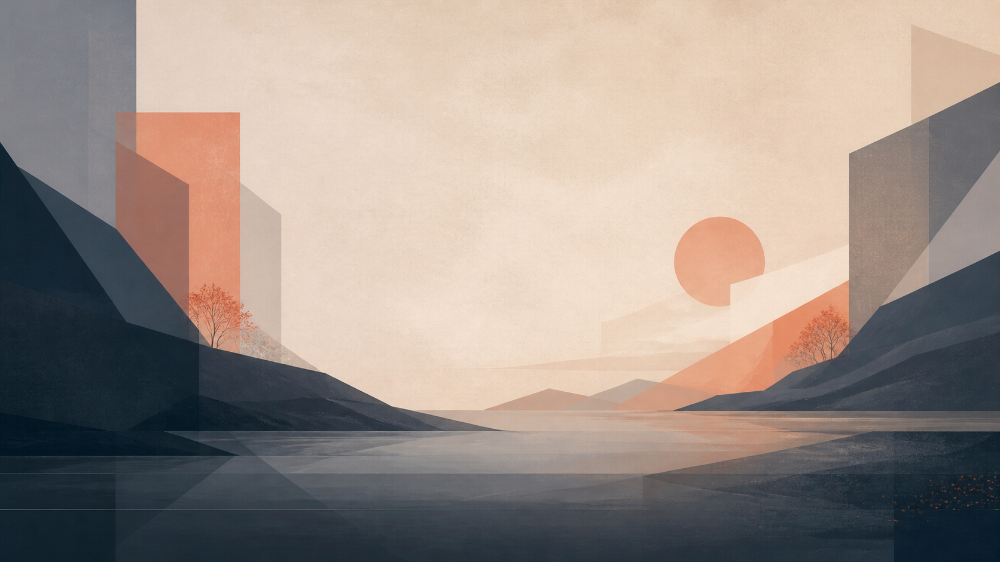](proper-horizon-dark.png) Alpine Morning |
| [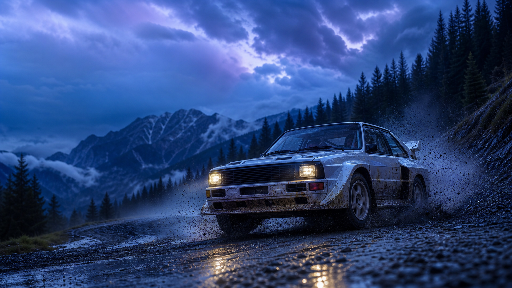](proper-rally-blue-hour.png) Rally Blue Hour | [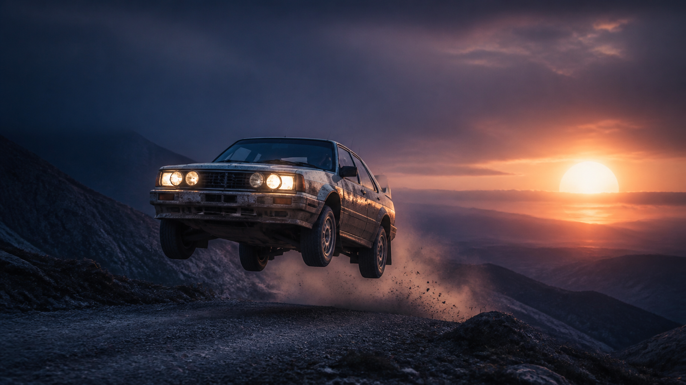](proper-rally-night-flight.png) Rally Night Flight |
| [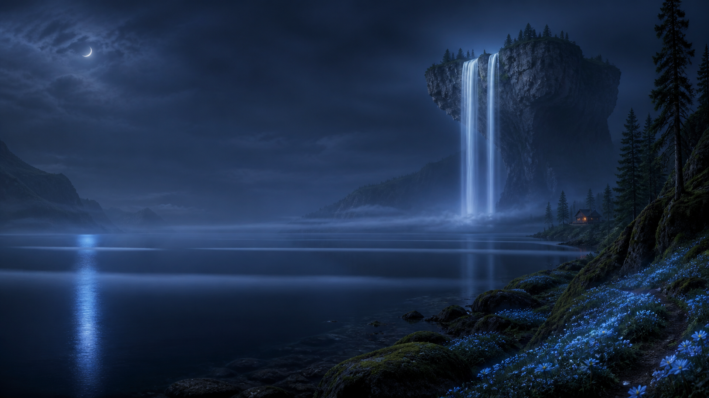](proper-floating-falls.png) Floating Falls | [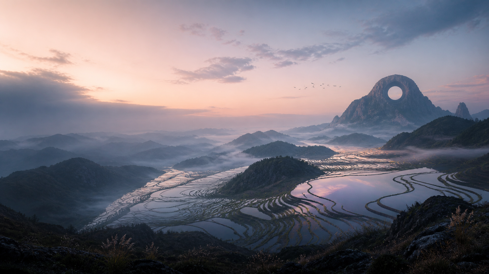](proper-terraced-dawn.png) Terraced Dawn |
| [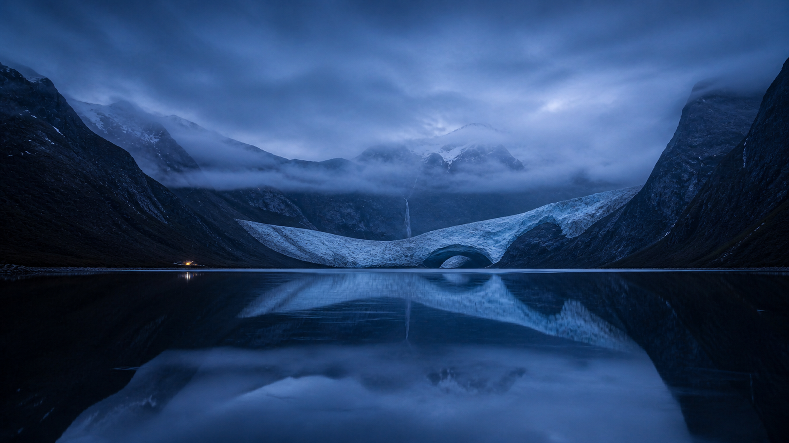](proper-glacial-arch.png) Glacial Arch | [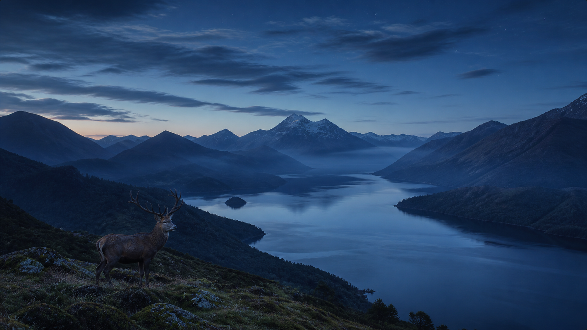](proper-highland-blue-hour.png) Highland Blue Hour |
| [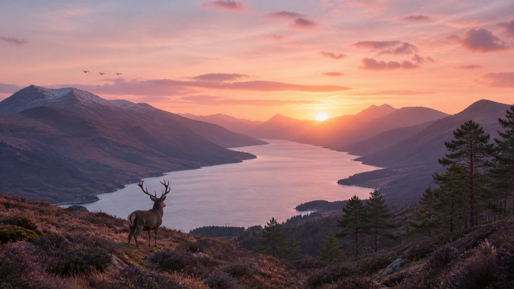](proper-highland-sunrise.png) Highland Sunrise | [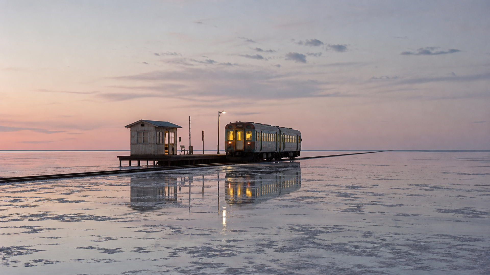](proper-salt-flat-station.png) Salt-Flat Station |
| [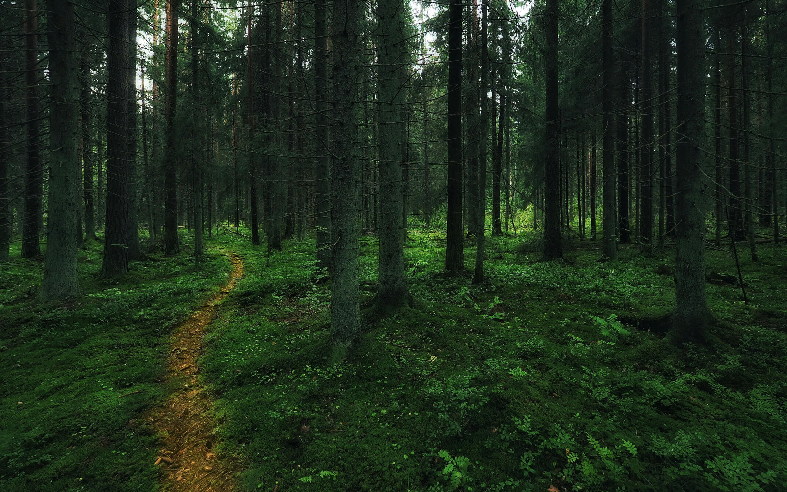](path.jpg) Path | [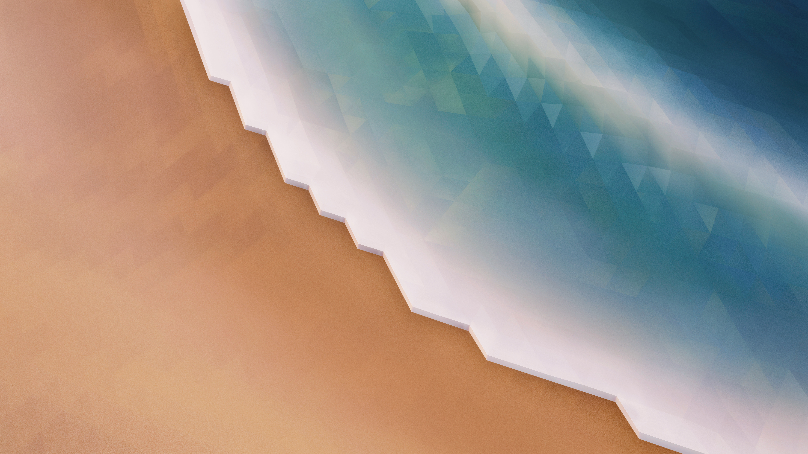](volna.jpg) Volna |
| [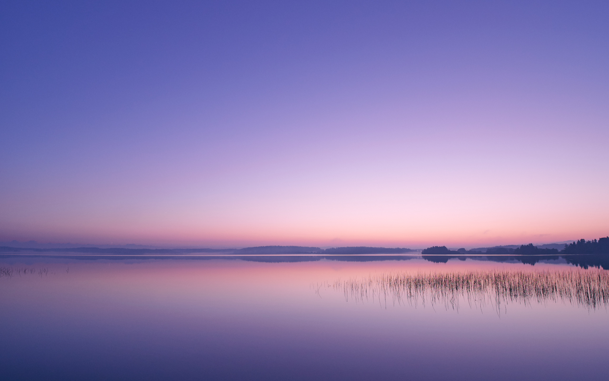](summer-1am.jpg) summer_1am |  |

## Sources and licences

## Original Proper wallpapers

The generated images were created with OpenAI image generation and are shipped
under CC-BY-SA-4.0. Source outputs were 1672×941 and packaged derivatives were
resized to 1920×1080 with Lanczos filtering. Supplied screenshots were used only
as broad composition or mood references and are not redistributed.

| Wallpaper | Packaged file | Direction or reference | SHA-256 |
| --- | --- | --- | --- |
| Proper Blue Hour (default) | [proper-blue-hour.png](proper-blue-hour.png) | Calm blue-hour mountain lake and distant city; no reference image | `5e5b6f957dc36e77f26f35d89280814f1ec77137760f3b9d907d48c196a9a70e` |
| Proper Alpine Morning | [proper-horizon-dark.png](proper-horizon-dark.png) | Restrained photographic alpine valley; no reference image | `96f1c7e8b7c89ccd006dd5cb302609c4e9c4183b8e3bf50516490bf9c2514735` |
| Proper Rally Blue Hour | [proper-rally-blue-hour.png](proper-rally-blue-hour.png) | Original rally scene using a supplied action composition as reference | `923a9d37b0fb0ea6e1a5c34ed1648b3fe22460ca2c7d76ebc43b54a85da14b30` |
| Proper Rally Night Flight | [proper-rally-night-flight.png](proper-rally-night-flight.png) | Original airborne rally scene using a supplied composition as reference | `58e69051af30557520f6363b4504abf691d380752ca5b99149104d2ac027ec77` |
| Proper Floating Falls | [proper-floating-falls.png](proper-floating-falls.png) | Moonlit fjord, floating plateau, waterfall, and quiet navy space; no reference image | `8afad0cfb1a441c36eedc1d52d73fb02a62c24023d54faa8b223db270331f8b3` |
| Proper Terraced Dawn | [proper-terraced-dawn.png](proper-terraced-dawn.png) | Dawn valley of reflective terraces and mist; no reference image | `00bfbc71686b9ebb4571fa482cdc73936543a0f50c08bc067c904f829d7e3a3a` |
| Proper Glacial Arch | [proper-glacial-arch.png](proper-glacial-arch.png) | Glacial valley using Proper Blue Hour only as a palette and restraint reference | `c253b55028429a259715581596cac7d5065980aeca37371d68a6c94c61b85b64` |
| Proper Highland Blue Hour | [proper-highland-blue-hour.png](proper-highland-blue-hour.png) | Photographic stag and loch using a supplied composition reference | `6df3acef9c4aea02582471f410e3cfdc4c488e0f9bcf0fdc56782a7ba2bebf9c` |
| Proper Highland Sunrise | [proper-highland-sunrise.png](proper-highland-sunrise.png) | Photographic sunrise stag and loch using a supplied composition reference | `c07317a6de831355bd4f855fb6926359b87488655a9f2a5940a3923a890422f9` |
| Proper Salt-Flat Station | [proper-salt-flat-station.png](proper-salt-flat-station.png) | Working railway platform on a shallow flooded salt flat; no reference image | `f9455a665b29270e75cbd37f50f07da4342eb98f20a769d40a34f898e4bf8aba` |

`ProperHorizon` remains the internal wallpaper ID for Proper Alpine Morning so
existing selections continue to work.

## Curated KDE wallpapers

Proper packages three files from KDE Plasma Workspace Wallpapers 6.7.4 under
their upstream IDs, rather than installing the complete wallpaper collection.

| Wallpaper | Author | Licence | Packaged file | SHA-256 |
| --- | --- | --- | --- | --- |
| Path | Risto Saukonpää `<paristo@gmail.com>` | LGPL-3.0-only | [path.jpg](path.jpg) | `7477457d7f17b736259f1b021864778ad4ba802cf3214e6728181ff29126bba8` |
| Volna | Nikita Babin `<raveomelette@gmail.com>` | CC-BY-SA-4.0 | [volna.jpg](volna.jpg) | `abc30b4fc6f6a83b6156e6b59ac283c067de40af820aafac8ac7c4fd83a9607c` |
| summer_1am | Risto Saukonpää `<paristo@gmail.com>` | LGPL-3.0-only | [summer-1am.jpg](summer-1am.jpg) | `c868b50789591dd42910153c768053f1ba0a98cb36bbfc2b7a96a1045d0477f8` |

Source: `plasma-workspace-wallpapers-6.7.4-1.fc44`. On update, recheck the
upstream metadata, licences, authors, and full-resolution file hashes.
